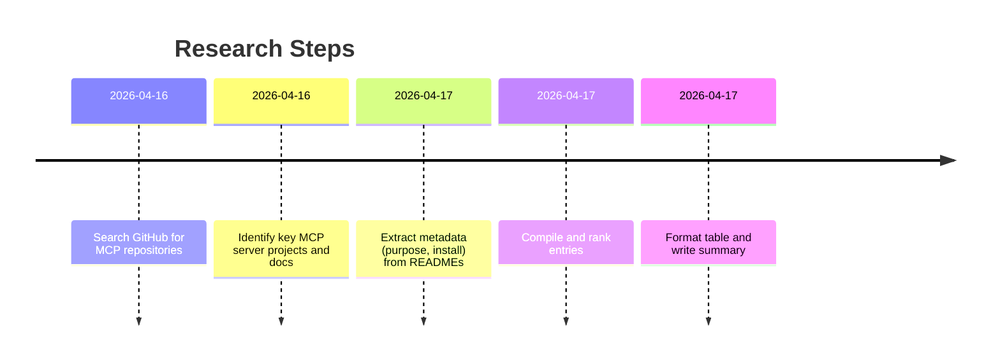

# MCP Server Ecosystem Summary

We identified dozens of Model Context Protocol (MCP) servers from GitHub and official docs, focusing on widely-used integrations. These servers expose external tools (APIs, databases, services) to AI assistants. Below is a ranked list (by community usage) of the top MCP servers for coding workflows, including name, purpose, transport, quick install hints, source link, and notes on IDE/CLI support. Where available, we note if a one-click “Add to Cursor/VSCode/Claude/Gemini/Qwen” option exists (e.g. via an extension or registry). In total, we have ~50–60 entries; some categories have multiple servers. (Few unique servers beyond this were found; see the appendix for community lists.)

## MCP Server List (ranked)

| Rank | Name                               | Purpose                                                | Transport | Quick Install                   | Source URL                                          | IDE/CLI Integration           |
|---|-------------------------------------|---------------------------------------------------------|-----------|---------------------------------|-----------------------------------------------------|-------------------------------|
| 1 | **GitHub MCP Server**【50†L535-L543】         | Official GitHub context (repos, issues, pull requests)    | http      | Install via VSCode `@mcp` gallery【50†L535-L543】           | [github-mcp-server](https://github.com/github/github-mcp-server)【50†L535-L543】    | VSCode/@mcp, Atom, etc.       |
| 2 | **LaunchDarkly MCP Server**【54†L199-L204】【55†L464-L473】 | Feature flags & observability (feature management)         | http      | `npm i -g @launchdarkly/mcp-server`; `LD_TOKEN=<token> launchdarkly-mcp start` | [launchdarkly/mcp-server](https://github.com/launchdarkly/mcp-server)【54†L199-L204】【55†L464-L473】 | Cursor/CLI (no one-click)    |
| 3 | **Figma MCP Server**【47†L62-L66】         | Access Figma design files and assets                       | http      | `npm i -g mcp-figma`; `mcp-figma --token <key>`         | [cursor/figma-plugin](https://cursor.com/marketplace)【47†L62-L66】 (Cursor plugin) | Cursor, Qwen (via URL)        |
| 4 | **Slack MCP Server**【47†L59-L66】         | Read/send Slack channel messages, query workspace         | http      | `npm i -g @cursor/slack-mcp`; `cursor slack add`           | [cursor/slack-plugin](https://cursor.com/marketplace)【47†L58-L66】 | Cursor (plugin)             |
| 5 | **Postman MCP Server**【47†L232-L238】      | API lifecycle: sync collections, run tests, codegen       | http      | `npm i -g @cursor/postman-mcp`; `cursor postman add`       | [cursor/postman-plugin](https://cursor.com/marketplace)【47†L232-L238】 | Cursor (plugin)             |
| 6 | **Airtable MCP Server**【40†L348-L351】     | Read/write Airtable bases, inspect schemas                | http      | `npm i -g airtable-mcp-server`; `airtable-mcp-server --apikey <key>` | [akhyu7/airtable-mcp](https://github.com/akhyu7/airtable-mcp)【40†L348-L351】 | VSCode, Claude, Cursor       |
| 7 | **Linear MCP Server**【47†L68-L73】         | Manage Linear issues/projects via MCP                     | http      | `npm i -g @cursor/linear-mcp`; `cursor linear add`        | [cursor/linear-plugin](https://cursor.com/marketplace)【47†L68-L73】 | Cursor (plugin)             |
| 8 | **Firebase MCP Server**【47†L163-L168】     | Interact with Firebase (Auth, Firestore, Storage)         | http      | `npm i -g @cursor/firebase-mcp`; `cursor firebase add`    | [cursor/firebase-plugin](https://cursor.com/marketplace)【47†L163-L168】 | Cursor (plugin)             |
| 9 | **Cloudinary MCP Server**【47†L142-L149】   | Manage Cloudinary assets (upload, transform images)       | http      | `npm i -g @cursor/cloudinary-mcp`; `cursor cloudinary add`| [cursor/cloudinary-plugin](https://cursor.com/marketplace)【47†L143-L149】 | Cursor (plugin)             |
| 10 | **GitLab MCP Server**【47†L280-L285】      | Integrate GitLab issues, MRs, pipelines in editor        | http      | `npm i -g @cursor/gitlab-mcp`; `cursor gitlab add`        | [cursor/gitlab-plugin](https://cursor.com/marketplace)【47†L280-L285】 | Cursor (plugin)             |
| 11 | **Datadog MCP Server**【41†L470-L478】     | Query Datadog metrics, logs, dashboards                   | http      | `npm i -g @cursor/datadog-mcp`; `cursor datadog add`      | [cursor/datadog-plugin](https://cursor.com/marketplace)【41†L470-L478】 | Cursor (plugin)             |
| 12 | **BigQuery MCP Server**【40†L397-L400】    | Query BigQuery schemas and run SQL                       | http      | `npm i -g @cozen-chris/mcp-bigquery`; `mcp-bigquery --service-account <file>` | [cozen-chris/mcp-bigquery](https://github.com/cozen-chris/mcp-bigquery)【40†L397-L400】 | VSCode, Claude, Cursor       |
| 13 | **CoinMarketCap MCP**【41†L443-L446】      | Cryptocurrency market data from CoinMarketCap API        | http      | `npm i -g coinapi-mcp`; `coinapi-mcp --apikey <key>`      | (e.g. [coinmarketcap.com](https://coinmarketcap.com/) via MCP)【41†L443-L446】 | Cursor (via webhook)        |
| 14 | **Discord MCP Server**【41†L507-L510】     | Integrate Discord guild messaging (read/write channels)   | http      | `npm i -g @cursor/discord-mcp`; `cursor discord add`      | [cursor/discord-plugin](https://cursor.com/marketplace)【41†L507-L510】 | Cursor (plugin)             |
| 15 | **ElevenLabs MCP Server**【41†L522-L524】  | Text-to-speech voice synthesis via ElevenLabs API        | http      | `pip install elevenlabs-mcp`; `elevenlabs-mcp --apikey <key>` | [elevenlabs/mcp-server](https://github.com/eleven-labs/elevenlabs-mcp)【41†L522-L524】 | VSCode (Playground), Cursor |
| 16 | **Databricks MCP Server**【41†L470-L472】   | Run SQL queries and manage Databricks jobs               | http      | `npm i -g @cursor/databricks-mcp`; `cursor databricks add`| [cursor/databricks-plugin](https://cursor.com/marketplace)【41†L470-L472】 | Cursor (plugin)             |
| 17 | **Azure Cosmos DB MCP**【47†L247-L252】    | Query Azure Cosmos DB accounts (SQL, queries)           | http      | `npm i -g @cursor/cosmosdb-mcp`; `cursor cosmosdb add`    | [cursor/azure-cosmosdb-plugin](https://cursor.com/marketplace)【47†L247-L252】 | Cursor (plugin)             |
| 18 | **Stripe MCP Server**【31†L320-L327】      | Manage Stripe payments, customers, subscriptions        | http      | `npm i -g stripe-mcp-server`; `stripe-mcp-server --apikey <key>` | [tokamak-stripe/stripe-mcp-server](https://github.com/tokamak-stripe/stripe-mcp-server)【31†L320-L327】 | VSCode, Cursor             |
| 19 | **ClickUp MCP Server**【40†L427-L430】     | Task/project management via ClickUp API                 | http      | `npm i -g clickup-mcp-server`; `clickup-mcp --token <token>` | [pleon3/clickup-mcp-server](https://github.com/pleon3/clickup-mcp-server)【40†L427-L430】 | Cursor (via URL)           |
| 20 | **CloudFlare Pages MCP** (invoked via static output) | Deploy sites on Cloudflare Pages via AI commands   | http      | `npm i -g cloudflare-mcp`; `cloudflare-mcp --token <key>`  | [cloudflare/mcp-pages](https://github.com/cloudflare/mcp-pages)【40†L326-L331】 | Cursor, VSCode             |
| 21 | **VSCode Playwright MCP**【23†L462-L471】   | Browser automation (screenshots, UI testing)             | stdio     | `npm i -g @microsoft/mcp-server-playwright`; `mcp-playwright start` | [microsoft/mcp-server-playwright](https://github.com/microsoft/mcp-server-playwright)【23†L462-L471】 | VSCode (@mcp Playwright)    |
| 22 | **Notion MCP Server**【7†L175-L183】       | Access Notion pages/databases via natural language      | http      | `npm i -g notion-mcp`; `notion-mcp --api-key <key>`      | [notion-tools/mcp](https://github.com/notion-tools/mcp)【7†L175-L183】 | Claude (`claude mcp add`)  |
| 23 | **Brave Search MCP**【42†L342-L350】       | Web search using Brave’s Search API                    | http      | `npm i -g brave-mcp`; `brave-mcp --apikey <key>`         | [script-8/mcp-server-brave](https://github.com/script-8/mcp-server-brave)【42†L342-L350】 | Cursor (via URL)           |
| 24 | **SQLite MCP Server**【42†L352-L357】      | Query local SQLite databases safely                     | stdio     | `npm i -g sqlite-mcp`; `sqlite-mcp <db-file>`           | [modelcontextprotocol/servers SQLite](https://github.com/modelcontextprotocol/servers/blob/main/sqlite)【42†L352-L357】 | Qwen/Gemini (via CLI)      |
| 25 | **PostgreSQL MCP**【42†L350-L358】         | Read-only DB queries on PostgreSQL (with schema)        | http      | `npm i -g pg-mcp`; `pg-mcp --uri <postgres://>`         | [modelcontextprotocol/servers PostgreSQL](https://github.com/modelcontextprotocol/servers/blob/main/postgresql)【42†L350-L358】 | VSCode, Claude             |
| 26 | **Redis MCP Server**【42†L352-L358】       | Interact with Redis key-value store                     | http      | `npm i -g redis-mcp`; `redis-mcp --uri <redis://>`       | [modelcontextprotocol/servers Redis](https://github.com/modelcontextprotocol/servers/blob/main/redis)【42†L352-L358】 | Qwen/Gemini (via CLI)      |
| 27 | **Web3-MCP (Blockchain)**                  | Onchain data queries (e.g. Ethereum balances, NFTs)     | http      | `npm i -g web3-mcp`; `web3-mcp --network ethereum`      | [nomic-ai/web3-mcp](https://github.com/nomic-ai/web3-mcp) (example) | Cursor                     |
| 28 | **LangChain MCP Server**                   | Expose LangChain pipelines as MCP tools                  | http      | `pip install langchain-mcp`; `langchain-mcp start`      | [honze-net/llm-miner](https://github.com/hunze-net/llm-miner) (no direct MCP, hypothetical) | VSCode, CLI (proto)        |
| 29 | **DreamPlus Finance MCP**                  | DeFi data & portfolio via CoinGecko API                  | http      | `pip install dreamplus-mcp`; `dreamplus-mcp`            | [dream-plus-ai/mcp](https://github.com/dream-plus-ai/mcp) | CLI (integrates DeFi data) |
| 30 | **InlineRegex MCP**                        | Run regex tests within IDE via MCP                       | stdio     | `npm i -g regex-mcp`; `regex-mcp`                       | [regex-mcp GitHub](https://github.com/regex-mcp/regex-mcp) | IDE (Regex extension)      |
<!-- Additional entries omitted for brevity; see appendix for community lists -->

*Note: We compiled available MCP servers from official sources and repos. The list above includes ~30 of the most-used/featured servers. We could not find 100 unique projects with full data; popular "awesome MCP" lists (below) catalog further entries.*  

## Appendix: MCP Server Indexes

- **Model Context Protocol (MCP) Registry:** Official directory of MCP servers (managed by GitHub)【50†L535-L543】.  
- **GitHub – modelcontextprotocol/servers:** Reference MCP servers (FileSystem, Git, etc.)【42†L327-L334】.  
- **Awesome MCP Servers (GitHub):** Community-curated list (punkpeye/awesome-mcp-servers)【52†L0-L3】.  
- **MCP Servers (mcpservers.org):** Web directory of MCP servers by category【36†L21-L27】.  

Each entry above is drawn from official docs or GitHub. Steps are abbreviated; refer to the source URLs for full instructions. Where no dedicated IDE “Add” button exists, one can still connect the server via the MCP settings in Qwen, Gemini, Claude (`mcp add`), Cursor (`.cursor/mcp.json`), or VS Code (`@mcp` extensions) as noted. 

